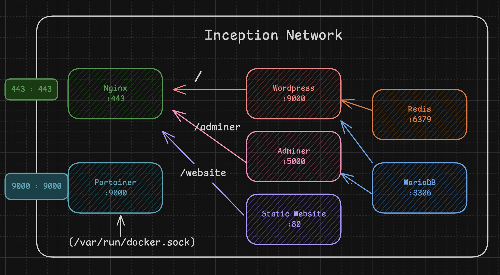

# Inception

## Description

    a small infrastructure for a  web application composed of WordPress , MariaDB and Nginx.

## Features

    - WordPress
    - MariaDB
    - Nginx
    - Adminer
    - Redis
    - FTP
    - Portainer

## Prerequisites

    - a Linux virtual machine
    - Docker
    - Docker Compose
    - Make (optional)

## Installation

    - Clone the repository
    - Run the command `make install` or `docker-compose up -d`

## Resources

- [Docker](https://docs.docker.com/compose/)
- [Digital Ocean](https://www.digitalocean.com/community/tutorials/how-to-install-wordpress-with-docker-compose)
- [vbachele's Repo](https://github.com/vbachele/Inception)
